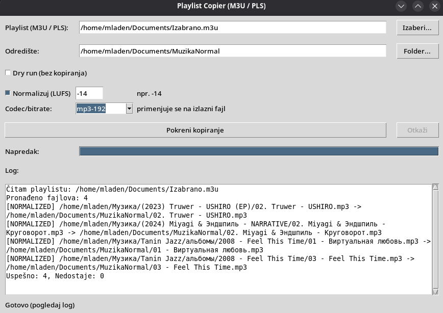

# Playlist Copier (M3U / PLS)

Mala CLI skripta koja pročita M3U/M3U8 ili PLS playlistu, pronađe pesme i kopira ih u zadati folder. Putanje u playlisti mogu biti relativne (računaju se od lokacije playliste) ili apsolutne.

## Priprema okruženja

```bash
python3 -m venv venv
source venv/bin/activate
```

Nema eksternih zavisnosti (koristi standardnu biblioteku).

## Pokretanje

### CLI

```bash
# M3U primer
./venv/bin/python playlist_copy.py /put/do/playlist.m3u /put/do/izlaznog/foldera

# PLS primer
./venv/bin/python playlist_copy.py /put/do/playlist.pls /put/do/izlaznog/foldera
```

Opcije:
- `--dry-run` samo prikaže šta bi se kopiralo, bez pisanja fajlova.
- `--normalize-lufs <broj>` normalizuje glasnoću na zadati LUFS (npr. `--normalize-lufs -14`, zahteva sistemski `ffmpeg`).
- `--codec-preset <preset>` bira codec/bitrate pri normalizaciji: `auto`, `mp3-192`, `mp3-256`, `aac-192`, `aac-256`, `flac`, `wav` (default `auto` = prema ekstenziji fajla).

Ako fajl već postoji u odredištu, skripta dodaje sufiks `_1`, `_2`, itd. kako bi sačuvala sve kopije.

### GUI (tkinter)

```bash
./venv/bin/python gui.py
```

GUI dozvoljava:
- izbor M3U/PLS fajla i odredišnog foldera preko dijaloga,
- checkbox za `Dry run`,
- opciono normalizovanje glasnoće (LUFS) i izbor codec/bitrate preseta (zahteva `ffmpeg`),
- progress bar i dugme „Otkaži“ za duže operacije,
- log prozor sa statusom i upozorenjima (npr. ako nedostaju fajlovi).

Primera radi, ovako izgleda GUI u radu:



## Kako radi

1. Ekstenzija playliste određuje parser (`.m3u`/`.m3u8` ili `.pls`).
2. Za svaku numerisanu ili listanu putanju pravi apsolutnu putanju (ako je relativna, računa se prema folderu u kom je sama lista).
3. Kopira fajlove u odredišni folder čuvajući originalne datoteke (koristi `copy2` da zadrži metapodatke).

## Pakovanje u izvršni fajl (Linux)

```bash
source venv/bin/activate
pip install pyinstaller
pyinstaller --onefile --name playlist-copier gui.py
```

Izvršni fajl će biti u `dist/playlist-copier`. Možeš ga pokrenuti direktno (tkinter biblioteka mora biti prisutna u sistemu, npr. `python3-tk` paket na Debian/Ubuntu).

## Kratki primer (test)

```bash
mkdir -p demo/tracks demo/output
printf '/absolute/path/do/pesme1.mp3\ndemo/tracks/pesma2.flac\n' > demo/test.m3u
touch /absolute/path/do/pesme1.mp3 demo/tracks/pesma2.flac

./venv/bin/python playlist_copy.py demo/test.m3u demo/output --dry-run
```

Prva linija pokazuje kako izgledaju apsolutne putanje, a druga relativne. U realnom slučaju zamenite ih stvarnim audio fajlovima.
